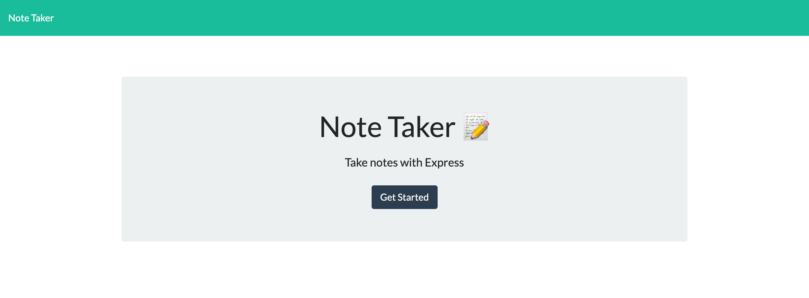
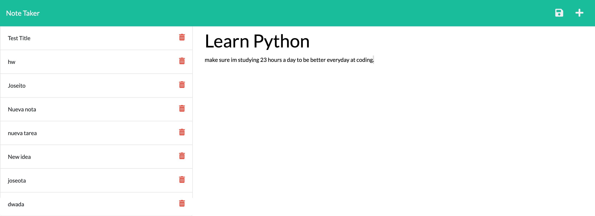

 [](https://opensource.org/licenses/MIT)
  # Note-taker-Express.js
 
  * [Installation](#installation)
  * [Description](#description)
  * [Usage](#usage)
  * [Contribution](#contribution)
  * [Instructions](#instructions)
  * [License](#license)
      
  ## Installation

    As a programmer:

  1. Git clone 
  2. install node.js 
  3. Command line (npm install)
  4. Command Line (node server.js) to get your pc to listen to port 3001.
  5. Go on Google Chrome Dev (and launch your local host [http://localhost:3001/](http://localhost:3001/) )
    
    As a user:

  1. For Note taker user just use link [Note Taker](https://wicked-chupacabra-08892.herokuapp.com/)

  ## Description

  This application is a note taker created using node.js, express.js, heroku, and other tools; to provide the user with a choice to create a note title and note text. The new note is saved on a database, organized, and displayed on a column for the user to see. Heroku was used to deploy the application with the coded server using Express.js.

  ## Usage

  Must have [Node.js](https://nodejs.org/en/) downloaded!

  As a programmer:
```sh 
    npm install
``` 
```sh 
    node server.js
```

On Google chrome Dev:
```sh 
   http://localhost:3001
```

For Note taker user:
```sh 
   https://wicked-chupacabra-08892.herokuapp.com/
```


  ## Contribution

  N/A

  ## Demo

 
 


  ## License
  This project is licensed under the [The MIT License](https://opensource.org/licenses/MIT)
      
  ## Questions
  * Checkout my [GitHub profile](https://github.com/joseobm92)
  
  * Any additional questions or feed back, feel free to [send an email](mailto:joseobm92@gmail.com). 
  ## License
  Copyright (c) [ joseobm92](https://github.com/joseobm92). All rights reserved.
  
  Licensed under the The MIT License license.